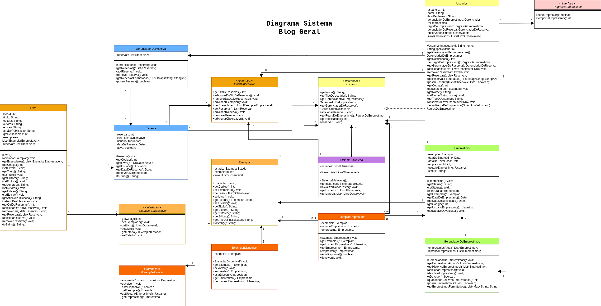
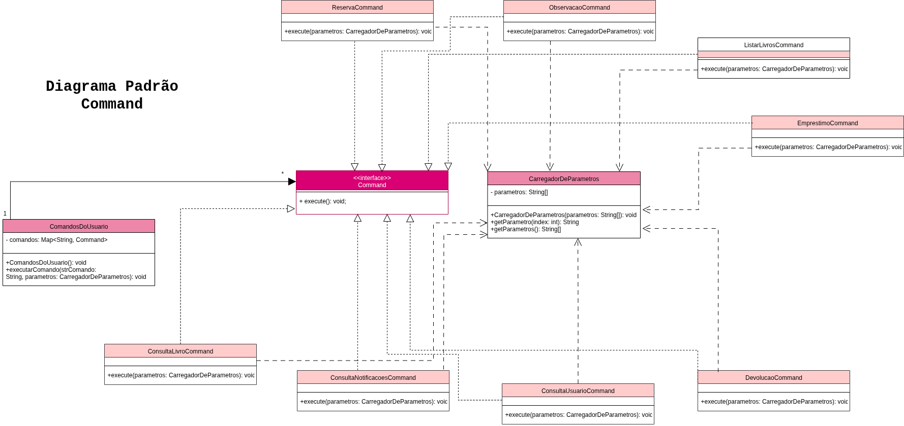
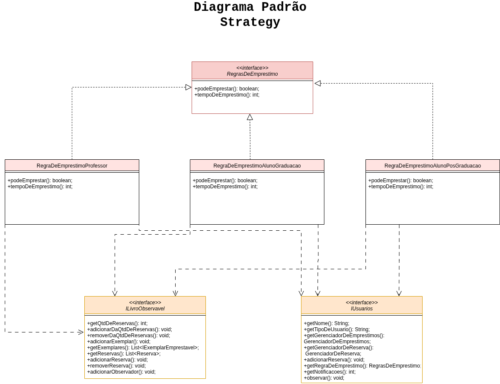
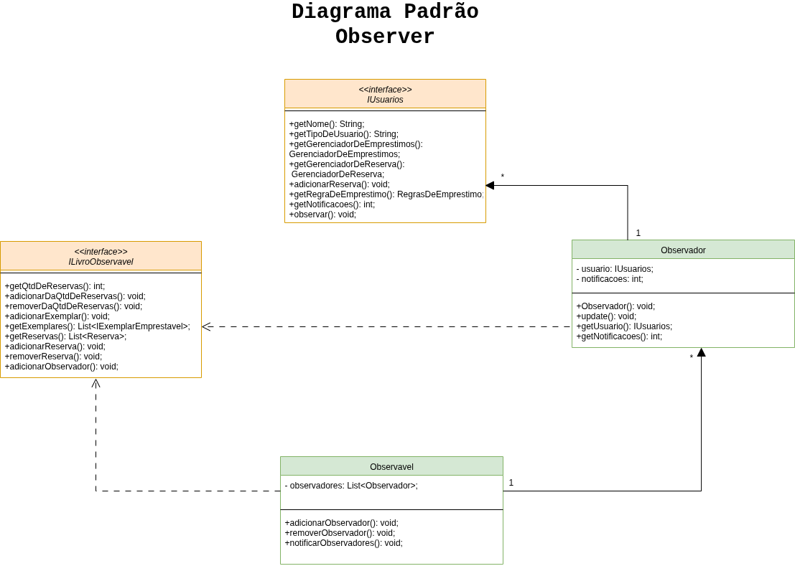

# 📚 Sistema de Gerenciamento de Biblioteca Acadêmica

Bem-vindo ao repositório do projeto de um sistema de biblioteca acadêmica, desenvolvido para a disciplina MATA62 - Engenharia de Software I na Universidade Federal da Bahia (UFBA).

O sistema simula o funcionamento de uma biblioteca, permitindo **empréstimo, devolução, reserva, consulta e observação de livros**, com regras de negócio específicas para cada tipo de usuário (Aluno de Graduação, Pós-Graduação e Professor).

---

## 💻 Interface de Uso

O sistema é executado via **linha de comando**, com os seguintes comandos disponíveis:

| Comando | Descrição |
|---|---|
| `emp <codUsu> <codLivro>` | Realiza um empréstimo |
| `dev <codUsu> <codLivro>` | Realiza uma devolução |
| `res <codUsu> <codLivro>` | Realiza uma reserva |
| `obs <codUsu> <codLivro>` | Adiciona um professor como observador de um livro |
| `liv <codLivro>` | Consulta os dados de um livro específico |
| `usu <codUsu>` | Consulta os dados de um usuário específico |
| `ntf <codUsu>` | Consulta o número de notificações recebidas por um usuário |
| `lus` | Lista todos os usuários cadastrados |
| `llv` | Lista todos os livros cadastrados |
| `sair` | Encerra o programa |

---

## ✨ Padrões de Projeto Aplicados

O sistema foi arquitetado com cinco padrões de projeto que trabalham em conjunto para criar uma solução coesa, extensível e alinhada aos requisitos.

*   **Singleton**: Aplicado na classe `SistemaBiblioteca`, que possui um construtor privado e um método estático `getInstance()`. Esta abordagem é ideal para o requisito de um sistema com estado centralizado, garantindo que todos os componentes acessem a mesma instância dos dados (livros e usuários) e evitando a necessidade de passar referências por todo o código.

*   **Command**: A interface `Command` define um método `execute()`, e classes concretas (`EmprestimoCommand`, `DevolucaoCommand`) encapsulam a lógica de cada ação. O `ComandosDoUsuario` atua como invocador, mapeando a entrada do usuário ao comando correspondente. Este padrão desacopla quem solicita a ação de quem a executa, tornando o sistema muito fácil de estender com novos comandos sem alterar o código existente.

*   **Strategy**: A interface `RegrasDeEmprestimo` define uma família de algoritmos, implementada por classes como `RegraDeEmprestimoAlunoGraduacao`. A classe `Usuarios` delega a lógica de validação de empréstimo a uma dessas estratégias. Esta é a solução perfeita para o requisito de que diferentes tipos de usuários tenham regras de empréstimo distintas, eliminando a necessidade de condicionais e tornando as regras claras, isoladas e fáceis de modificar.

*   **Observer**: A classe `Livro` estende `Observavel`, mantendo uma lista de `Observador` (composto por `Usuarios`). Quando o número de reservas de um livro ultrapassa o limite, ele notifica todos os seus observadores. Este padrão modela perfeitamente a relação "publicador/assinante" exigida pelo requisito de notificação. A implementação foi feita com **herança** (`Livro` é um `Observavel`), uma abordagem clássica e direta para este cenário.

*   **State**: A interface `IExemplarEstado` e suas implementações (`ExemplarDisponivel`, `ExemplarEmprestado`) gerenciam a disponibilidade de um `Exemplar`. Em vez de usar condicionais para verificar a disponibilidade, o comportamento de `emprestar()` e `devolver()` é delegado ao objeto de estado atual. Isso atende ao requisito de que um exemplar tenha comportamentos diferentes com base em sua disponibilidade de forma limpa e extensível.

---

##  UML

Abaixo estão os diagramas que modelam a arquitetura e os padrões implementados no sistema.

### Diagrama Geral


### Padrão Command


### Padrão Strategy


### Padrão Observer


---

## 🚀 Como Rodar Localmente

1.  **Clone o repositório:**
    ```bash
    git clone https://github.com/seu-usuario/MATA62---Sistema-de-Biblioteca.git
    cd MATA62---Sistema-de-Biblioteca
    ```

2.  **Compile os arquivos Java:**
    Navegue até o diretório raiz do projeto e compile todos os arquivos `.java`.
    ```bash
    javac ./BIBLIOTECA/Sistema/Main.java -d .
    ```

3.  **Execute o sistema:**
    ```bash
    java BIBLIOTECA.Sistema.Main
    ```

---

## 👨‍💻 Desenvolvedoras

*   **Amanda Vilas Boas** – [@amandavbo](https://github.com/amandavbo)
*   **Nalanda Santana Pita** – [@nalandap](https://github.com/nalandap)

---

